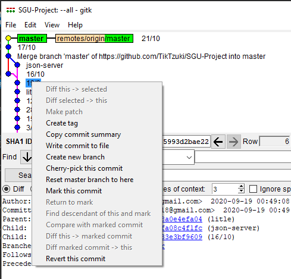
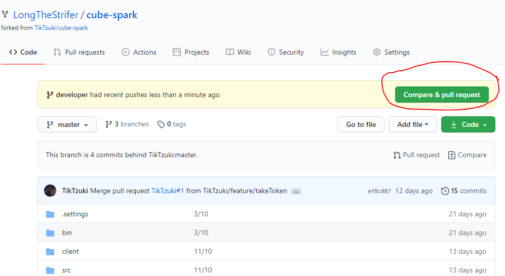
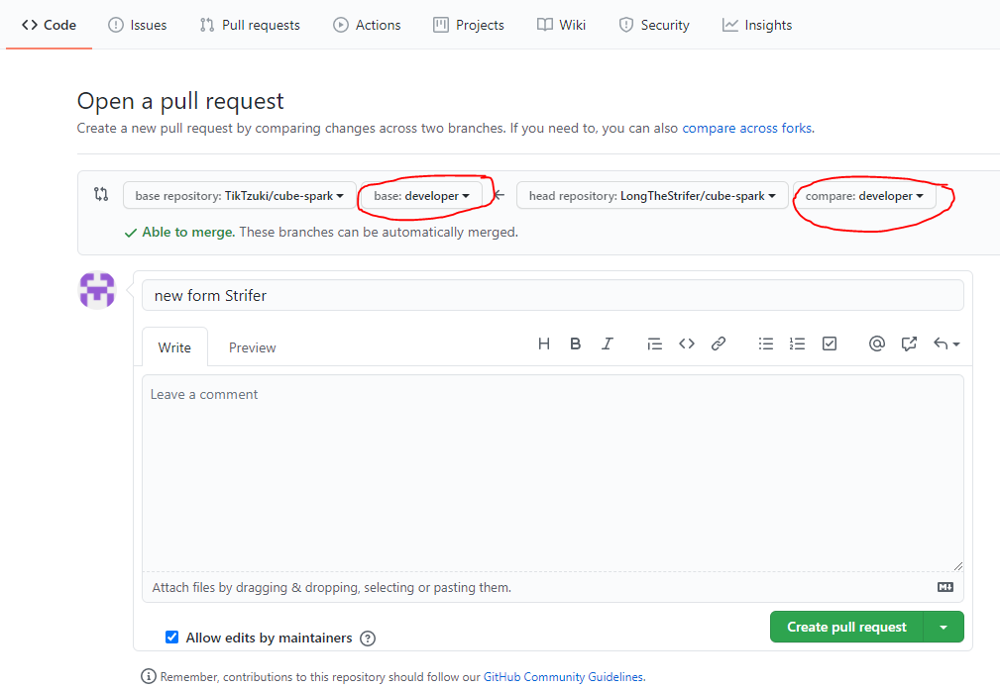

# override_project

## I. Quy trình git

## II. Quy tắc
Không làm việc trên nhánh master.\
Đặt tên branch viết feature theo format feature-featureName ví dụ: feature-productManage
## III. Công cụ


Bạn có thể dùng git gồm **git bash** để sử dụng command và **git GUI** để sử dụng giao diện git thay cho github desktop.
https://git-scm.com/

## III. Quy trình làm việc của một cá nhân - vòng lặp nhỏ

Nếu chưa clone:
> git clone https://github.com/TikTzuki/override-project-document.git

Nếu đã clone:\
### 1. Luôn bắt đầu phiên làm việc với:
```javacript
> git pull
```
### 2. Kiểm tra branch hiện tại, thường khi sửa dụng git bash thì bạn cũng đã biết branch hiện tại của mình.\
- Nếu cần tách branch từ branch hiện tại:
```php
> git branch feature-productManage
```

- Nếu cần chuyển qua branch khác. Khi chuyển branch thì nội dung thư mục cũng sẽ thay đổi thành nội dung của branch đó:
```php
> git checkout feature-productManage
```
>Lưu ý: **luôn commit trước khi chuyển branch** nếu không muốn code của mình vừa cặm cuội viết mất tích.
- Tạo mới branch và chuyển luôn sang branch đấy để code:
```php
> git checkout -b feature-productManage
```
### 3. Viết code lọc cọc
### 4. Add những thay đổi vào local repository
```php
> git add *
```
### 5. Commit để lưu thay đổi trong **branch hiện tại**
```php
> git commit -am "message"
```
### 6. Push lên server repository
>Lưu ý: kiểm tra **tên remote** (vd: origin) và **tên branch** (vd: feature/productManage)
```php
> git push origin feature-productManage
```
>Tất cả những công việc trên bạn đều có thể dùng phần mềm giao diện nhưng không khuyến khích
---
Bạn có thể quay lại commit (revert commit) cũ bằng Git GUI một cách dễ dàng
> Repository -> Visualize All Branch History. Chuột phải vào commit: 



---

### 7. Nỗi đau muôn thuở: git merge
Để merge code từ nhánh B vào nhánh A.
- Checkout về nhánh A
```
> git checkout A
```
- Merge nhánh B vào
```
> git merge B
```
- Khi xảy ra conflict lệnh git sẽ ở trạng thái merging, bạn cần thay đổi những phần code bị conflict, add -> commit.

## IV. Git fork - vòng lặp vĩ đại
Fork là cách tách ra và làm việc độc lập thay cho việc tất cả cùng đè 1 repository mà code và xử lý conflict liên tục.

### 1. Giai đoạn set-up
1 - Fork từ repository gốc về git của bạn trên server repository\
2 - Clone git về\
3 - Ngoài 1 remote mặc định là origin, bạn cần tạo thêm 1 remote mới tên là upstream kết nối tới repository gốc
```
> git remote add upstream https://github.com/ORIGINAL_OWNER/ORIGINAL_REPOSITORY.git

// Kiểm tra lại danh sách remote
> git remote -v
```
### 2. Giai đoạn làm việc cá nhân
#### 2.1 Update phiên bản mới nhất
Với fork, trong khi bạn code với vòng lặp nhỏ. sẽ có lúc bạn cần update repos của bạn lên phiên bản mới nhất của original repos. **Bạn chỉ cần cập nhật phiên bản từ branch main của repos gốc**\
Để đồng bộ với phiên bản mới nhất của original repository:
```
// Bước 1
> git fetch upstream
// Bước 2
> git checkout main
// Bước 3
> git merge upstream/main
```
#### 2.2 Đưa code về cho original repos - pull request
Khi hoàn thành 1 task hoặc 1 feature trên 1 branch, bạn cần đưa phần đã hoàn thiện về original repos với pull request:
Nhớ push tất cả commit của branch chứa task đã hoàn thành lên server repos của cá nhân thì mới có cái mà pull request được nhé.

> Lưu ý: **branch origin repos và branch chứa task của bạn**

